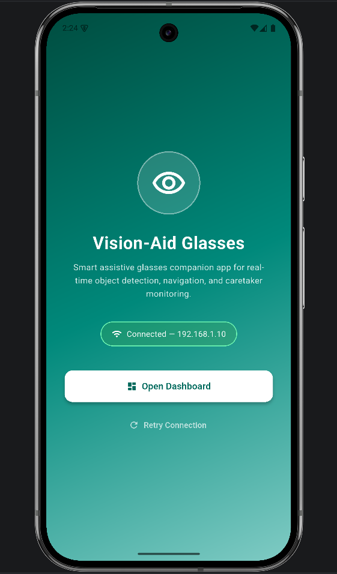
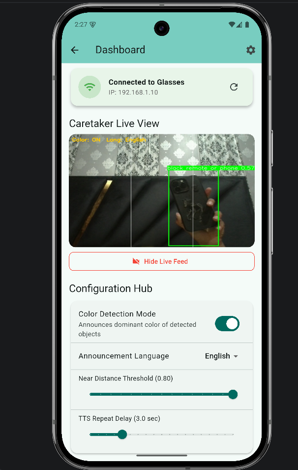
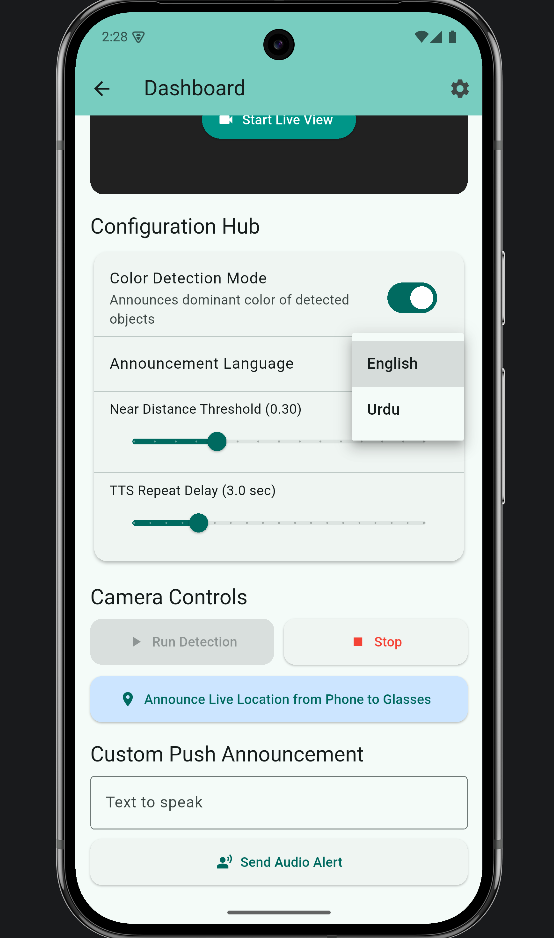

# 👓 Vision Aid Glasses App

A sophisticated Flutter-based companion application for Vision Aid Glasses. This app acts as a caretaker hub, providing real-time video streaming, object detection controls, and remote audio communication to assist visually impaired users through a connected Raspberry Pi system.

---

## 📱 Features

🎥 **Real-Time Video Streaming**: View a live feed from the glasses' camera with optimized frame rates.

🤖 **Object Detection Control**: Remotely start and stop YOLOv5-based object detection on the wearable device.

🗣️ **Remote Audio Announcements**: Send custom text messages to be spoken via the glasses' eSpeak engine.

⚙️ **Dynamic Configuration**: Update detection parameters and device settings on the fly.

🔗 **Connection Monitoring**: Real-time status checks to ensure the link between the app and the glasses is active.

🎨 **Intuitive Dashboard**: Clean, card-based UI design for easy navigation and control.

⚡ **Optimized State Management**: Powered by the `provider` package for a responsive and reactive experience.

---

## 📸 Screenshots

> /screenshots 

|        Home Screen        |         Camera Feed         |          Dashboard Hub          |
|:-------------------------:|:---------------------------:|:-------------------------------:|
|  |  |   | 

---

## 📂 Project Structure

The project follows a modular architecture for better maintainability:
```
lib/
│
├── providers/
│   └── glasses_provider.dart      # Manages application state and API logic
│
├── screens/
│   ├── home_screen.dart           # Primary entry point
│   └── dashboard_screen.dart      # Main control hub
│
├── services/
│   └── api_service.dart           # Low-level REST API communication
│
├── widgets/
│   ├── audio_announcement_card.dart
│   ├── camera_controls_card.dart
│   ├── config_hub_card.dart
│   ├── connection_status_card.dart
│   └── live_view_card.dart
│
├── api_service.dart               # Core API utility
└── main.dart                      # App entry point & Provider setup
```

## 🔹 Providers

* **GlassesProvider**: Orchestrates communication between the UI and the hardware. It handles status polling, command execution, and state updates.

## 🔹 Services

* **ApiService**: Contains the logic for HTTP requests to the Raspberry Pi backend, including endpoints for `/status`, `/start`, `/stop`, and `/speak`.

## 🔹 Screens & Widgets

* **Dashboard**: A focused view for caretakers to monitor the camera feed and trigger detection.
* **Reusable Cards**: Modular widgets for specific functions like audio messages and system configuration.

---

## ⚙️ Technologies Used

🔹 **Flutter**

🔹 **Dart**

🔹 **Provider** (State Management)

🔹 **HTTP** (REST API Communication)

🔹 **WebView Flutter** (For Video Streaming)

🔹 **Geolocator & Geocoding** (Location Services)

🔹 **Shared Preferences** (Local Config Storage)

---

## 🚀 How to Run the Project

1. **Clone the repository**:
```bash
git clone https://github.com/Dev-Muhammad-Faizan/vision_aid_glasses_app.git
```

2. **Navigate to the project directory**:
```bash
cd vision_aid_glasses_app
```

3. **Install dependencies**:
```bash
flutter pub get
```

4. **Connect to Glasses**:
   Ensure your mobile device is on the same network as the Vision Aid Glasses hardware.

5. **Run the app**:
```bash
flutter run
```

---

## 🎯 Learning Outcomes

This project demonstrates:

* Architecture of a hardware-companion mobile app.
* Implementing real-time communication via REST APIs.
* Advanced state management with `Provider`.
* Modular UI design using reusable Flutter widgets.
* Integration of web-based video streams within native apps.
* Handling asynchronous operations and hardware timeouts.

---

## 👨‍💻 Author

**Muhammad Faizan**
BS Software Engineering Student
Flutter and Dart Developer

---

⭐ If you find this project helpful, feel free to star the repository!
